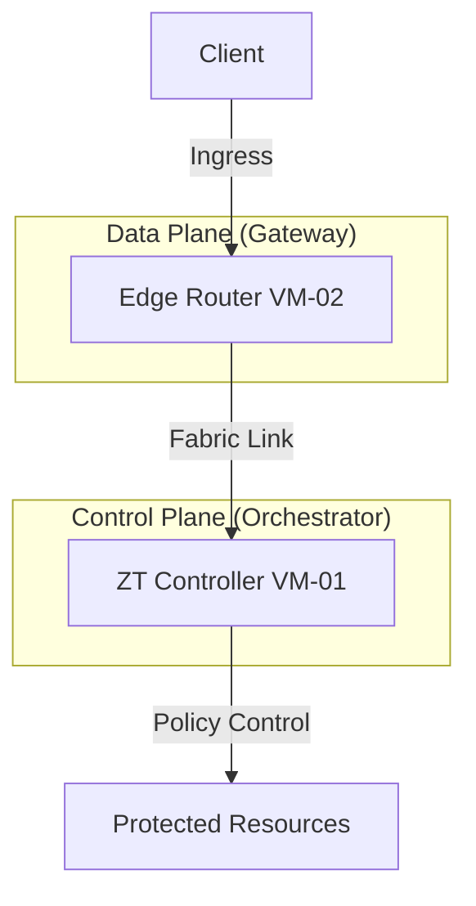

# 🚀 OpenZiti ZTNA Lab Setup (Controller + Edge Router)

[](https://openziti.io/)
[](https://csrc.nist.gov/publications/detail/sp/800-207/final)
[](#)

Dokumentasi ini menjelaskan prosedur instalasi **OpenZiti Zero Trust Network Access (ZTNA)** menggunakan arsitektur Multi-VM. Infrastruktur ini dirancang sebagai *testbed* untuk eksperimen keamanan berbasis **NIST SP 800-207** dan fondasi integrasi **AI-based Policy Decision Point (PDP)**.

---

## 🏗️ Network Topology

Arsitektur ini memisahkan **Control Plane** (Manajemen Kebijakan) dan **Data Plane** (Jalur Data Terenkripsi).



---

## 🖥️ System Requirements & Configuration

### VM Network Setup

Gunakan IP statis agar koneksi antar node tetap persisten selama eksperimen.

| VM Role | Hostname | IP Address | OS |
| --- | --- | --- | --- |
| **VM-01 (Controller)** | `zt-controller` | `192.168.100.10` | Ubuntu 20.04/22.04 |
| **VM-02 (Edge Router)** | `zt-edge-router` | `192.168.100.11` | Ubuntu 20.04/22.04 |

### Port Requirements

| Port | Function | Protocol |
| --- | --- | --- |
| **8440** | Controller Management API | TCP |
| **8441** | Edge API (Enrollment/Client) | TCP |
| **8442** | Router Client Ingress | TCP |
| **10080** | Router Fabric Link | TCP |

---

## 🛠️ PART 1 — Setup VM-01 (ZT Controller)

### 1. Persiapan Sistem

Jalankan di **VM-01**:

```bash
sudo apt update && sudo apt upgrade -y
sudo apt install curl wget gnupg jq -y

```

### 2. Konfigurasi Environment Variables

```bash
export EXTERNAL_IP="192.168.100.10"
export ZITI_CTRL_EDGE_IP_OVERRIDE=$EXTERNAL_IP
export ZITI_CTRL_ADVERTISED_ADDRESS=$EXTERNAL_IP
export ZITI_CTRL_ADVERTISED_PORT=8440
export ZITI_CTRL_EDGE_ADVERTISED_ADDRESS=$EXTERNAL_IP
export ZITI_CTRL_EDGE_ADVERTISED_PORT=8441
export ZITI_ROUTER_ADVERTISED_ADDRESS=$EXTERNAL_IP
export ZITI_ROUTER_IP_OVERRIDE=$EXTERNAL_IP
export ZITI_ROUTER_PORT=8442

```

### 3. Instalasi OpenZiti Quickstart

```bash
source /dev/stdin <<< "$(wget -qO- https://get.openziti.io/ziti-cli-functions.sh)"

# Jalankan instalasi otomatis
expressInstall

# Load environment variables
source ~/.ziti/quickstart/Ubuntu/Ubuntu.env
```

### 4. Konfigurasi Systemd Controller

Agar Controller berjalan otomatis saat *booting*:

```bash
# 1. Hentikan proses yang berjalan manual saat instalasi
stopRouter
stopController

# 2. Generate unit files secara otomatis
createControllerSystemdFile
createRouterSystemdFile "${ZITI_ROUTER_NAME}"

# 3. Install dan Aktifkan service
sudo cp "${ZITI_HOME}/${ZITI_CTRL_NAME}.service" /etc/systemd/system/ziti-controller.service
sudo cp "${ZITI_HOME}/${ZITI_ROUTER_NAME}.service" /etc/systemd/system/ziti-router.service

sudo systemctl daemon-reload
sudo systemctl enable --now ziti-controller
sudo systemctl enable --now ziti-router

```

### 5. Administrasi & Login Controller

Setelah layanan berjalan melalui Systemd, gunakan perintah berikut untuk masuk ke mode administrasi. Di tahap ini, Anda tidak perlu lagi menjalankan router secara manual.

```bash
# Memuat environment (Wajib dilakukan setiap membuka jendela terminal baru)
source ~/.ziti/quickstart/Ubuntu/Ubuntu.env

# Login ke Management API
# Gunakan password Admin yang muncul di akhir log proses 'expressInstall'
ziti edge login 192.168.100.10:8441

# Verifikasi status layanan
ziti edge list edge-routers

```

---

## 🔑 PART 2 — Provisioning Identity untuk VM-02

Masih di **VM-01**, buat identitas digital untuk router eksternal (VM-02):

```bash
# Create Router Identity
ziti edge create edge-router vm02-router --jwt-output-file vm02-router.jwt

# Transfer token ke VM-02 (Sesuaikan username)
scp vm02-router.jwt user@192.168.100.11:~

```

---

## 🛣️ PART 3 — Setup VM-02 (Edge Router)

### 1. Instalasi Binary

Jalankan di **VM-02**:

```bash
curl -LO https://get.openziti.io/install.bash
sudo bash install.bash openziti

```

### 2. Enrollment

```bash
# Buat file konfigurasi router
ziti create config router edge --routerName vm02-router --output edge-router.yaml

# Proses Pendaftaran
ziti router enroll edge-router.yaml --jwt vm02-router.jwt

```

### 3. Konfigurasi Systemd Router

Agar Edge Router berjalan sebagai *background service*:

```bash
sudo bash -c "cat <<EOF > /etc/systemd/system/ziti-router.service
[Unit]
Description=OpenZiti Edge Router
After=network.target

[Service]
User=$USER
WorkingDirectory=$HOME
ExecStart=/usr/local/bin/ziti router run $HOME/edge-router.yaml
Restart=always
RestartSec=10

[Install]
WantedBy=multi-user.target
EOF"

sudo systemctl daemon-reload
sudo systemctl enable --now ziti-router

```

---

## ✅ PART 4 — Verifikasi Status Akhir

Kembali ke **VM-01**, jalankan perintah berikut untuk memastikan semua node berstatus **Online**:

```bash
ziti edge list edge-routers

```

**Expected Output:**
| NAME | ONLINE |
| :--- | :--- |
| `Ubuntu-edge-router` | `true` |
| `vm02-router` | `true` |

---

## 🛠️ Management & Debugging

| Action | Command |
| --- | --- |
| Check Controller Log | `journalctl -u ziti-controller -f` |
| Check Router Log | `journalctl -u ziti-router -f` |
| Restart Controller | `sudo systemctl restart ziti-controller` |
| Restart Router | `sudo systemctl restart ziti-router` |

```
