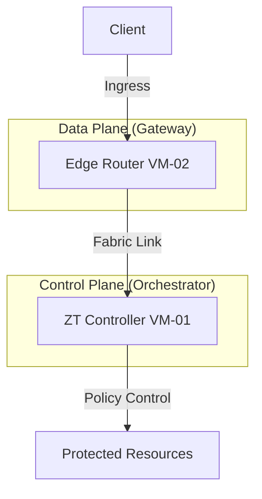

# 🚀 OpenZiti ZTNA Lab Setup (Controller + Edge Router)

[](https://openziti.io/)
[](https://csrc.nist.gov/publications/detail/sp/800-207/final)
[](#)

Dokumentasi ini menjelaskan prosedur instalasi **OpenZiti Zero Trust Network Access (ZTNA)** menggunakan arsitektur Multi-VM. Infrastruktur ini dirancang sebagai *testbed* untuk eksperimen keamanan berbasis NIST SP 800-207 dan fondasi integrasi **AI-based Policy Decision Point (PDP)**.

---

## 🏗️ Network Topology

Arsitektur ini memisahkan **Control Plane** (Manajemen Kebijakan) dan **Data Plane** (Jalur Data Terenkripsi).




---

## 🖥️ System Requirements & Configuration

### VM Network Setup

Gunakan IP statis agar koneksi antar node tetap persisten selama eksperimen.

| VM Role | Hostname | IP Address | OS |
| --- | --- | --- | --- |
| **VM-01 (Controller)** | `zt-controller` | `192.168.100.10` | Ubuntu 20.04/22.04 |
| **VM-02 (Edge Router)** | `zt-edge-router` | `192.168.100.11` | Ubuntu 20.04/22.04 |

### Port Requirements

| Port | Function | Protocol |
| --- | --- | --- |
| **8440** | Controller Management API | TCP |
| **8441** | Edge API (Enrollment/Client) | TCP |
| **8442** | Router Client Ingress | TCP |
| **10080** | Router Fabric Link | TCP |

---

## 🛠️ PART 1 — Setup VM-01 (ZT Controller)

### 1. Persiapan Sistem

```bash
sudo apt update && sudo apt upgrade -y
sudo apt install curl wget gnupg -y

```

### 2. Konfigurasi Environment Variables

Atur variabel agar Controller mengiklankan alamat IP yang benar:

```bash
export EXTERNAL_IP="192.168.100.10"

export ZITI_CTRL_EDGE_IP_OVERRIDE=$EXTERNAL_IP
export ZITI_CTRL_ADVERTISED_ADDRESS=$EXTERNAL_IP
export ZITI_CTRL_ADVERTISED_PORT=8440

export ZITI_CTRL_EDGE_ADVERTISED_ADDRESS=$EXTERNAL_IP
export ZITI_CTRL_EDGE_ADVERTISED_PORT=8441

export ZITI_ROUTER_ADVERTISED_ADDRESS=$EXTERNAL_IP
export ZITI_ROUTER_IP_OVERRIDE=$EXTERNAL_IP
export ZITI_ROUTER_PORT=8442

```

### 3. Instalasi OpenZiti Quickstart

Muat fungsi pembantu (helper) dan jalankan instalasi otomatis:

```bash
source /dev/stdin <<< "$(wget -qO- [https://get.openziti.io/quick/ziti-cli-functions.sh](https://get.openziti.io/quick/ziti-cli-functions.sh))"

# Jalankan instalasi otomatis
expressInstall

```

### 4. Aktivasi Controller

```bash
# Load environment yang baru dibuat
source ~/.ziti/quickstart/Ubuntu/Ubuntu.env

# Jalankan Controller di background
$ZITI_BIN_DIR/ziti controller run $ZITI_HOME/Ubuntu.yaml &

# Login ke Controller (Gunakan password hasil expressInstall)
$ZITI_BIN_DIR/ziti edge login 192.168.100.10:8441

```

### 5. Start Local Edge Router (Bootstrap)

```bash
$ZITI_BIN_DIR/ziti router run $ZITI_HOME/Ubuntu-edge-router.yaml &

```

---

## 🔑 PART 2 — Provisioning Identity untuk VM-02

Masih di **VM-01**, buat identitas digital untuk router yang akan dipasang di VM-02:

```bash
# Create Router Identity
$ZITI_BIN_DIR/ziti edge create edge-router vm02-router --jwt-output-file vm02-router.jwt

# Transfer token ke VM-02 (Ganti 'user' dengan username VM-02 Anda)
scp vm02-router.jwt user@192.168.100.11:~

```

---

## 🛣️ PART 3 — Setup VM-02 (Edge Router)

### 1. Instalasi Binary

Jalankan perintah berikut di **VM-02**:

```bash
curl -LO [https://get.openziti.io/install.bash](https://get.openziti.io/install.bash)
sudo bash install.bash openziti

```

### 2. Konfigurasi & Enrollment

Daftarkan router ke Controller menggunakan token JWT:

```bash
# Buat file konfigurasi router
ziti create config router edge --routerName vm02-router --output edge-router.yaml

# Proses Pendaftaran (Enrollment)
ziti router enroll edge-router.yaml --jwt vm02-router.jwt

```

### 3. Menjalankan Edge Router

```bash
ziti router run edge-router.yaml &

```

---

## ✅ PART 4 — Verifikasi Status Akhir

Kembali ke **VM-01**, jalankan perintah berikut untuk memastikan semua router terhubung:

```bash
$ZITI_BIN_DIR/ziti edge list edge-routers

```

**Output yang diharapkan:**
| NAME | ONLINE |
| :--- | :--- |
| `Ubuntu-edge-router` | `true` |
| `vm02-router` | `true` |

---

## 🎯 Kesimpulan & Hasil

Setup berhasil menghasilkan **OpenZiti ZTNA Network** dengan spesifikasi:

* ✔️ **Control Plane Active**: Mengelola identitas dan kebijakan akses.
* ✔️ **Distributed Data Plane**: Multiple edge routers siap menangani lalu lintas.
* ✔️ **Secure Overlay**: Komunikasi antar node melalui terowongan terenkripsi mTLS.
* ✔️ **Foundation Ready**: Siap untuk integrasi AI Policy Engine dan Anomaly Detection.

---

> **Note:** Lingkungan ini hanya untuk kebutuhan Lab. Untuk skala produksi, sangat disarankan menggunakan Systemd untuk manajemen service.

```

Apakah Anda ingin saya bantu membuatkan file **Systemd Service** agar Controller dan Router ini otomatis berjalan setiap kali VM dinyalakan?

```
